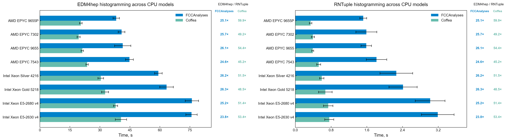
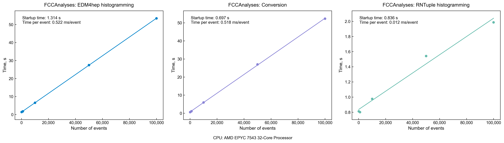
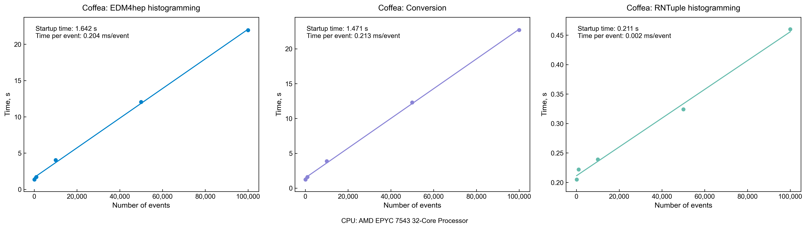

# EDM4hep Columnar Analysis Workflows

## 1. Introduction

This repository contains two prototype workflows for creating and analysing reduced columnar data derived from the [EDM4hep](https://edm4hep.web.cern.ch/) event model for [FCC-ee](https://home.cern/science/accelerators/future-circular-collider) users.

EDM4hep describes the common event data model used in ongoing FCC simulation studies. It consists of a series of C++ classes representing detector and physics objects corresponding to each aspect of the simulation and event reconstruction pipeline. While important for detailed studies, these data structures are inefficient for data analysis users who instead would benefit from columnar data optimized for analysis. As FCC-ee aims to collect more than a trillion Z-boson decays, speed of analysis code is particularly important. Compact columnar formats will improve analysis throughput and reduce the time required to obtain physics results.

The project implements the same configurable workflow using two analysis frameworks:

- **[FCCAnalyses](https://hep-fcc.github.io/FCCAnalyses/)**, using ROOT RDataFrame and the [Key4hep](https://key4hep.github.io/) software stack

- **[Coffea](https://coffea-hep.readthedocs.io/)**, using NanoEvents, [Awkward Array](https://awkward-array.org/) and [Uproot](https://uproot.readthedocs.io/)

Both implementations support:

- configurable output columns
- configurable event selection
- user-defined additional fields
- conversion from EDM4hep to a reduced ROOT RNTuple
- histogram driven validation comparing results produced directly from EDM4hep and the reduced RNTuple

The two implementations are kept as similar as possible so that their outputs and performance can be compared.

## 2. Installation and Setup

FCCAnalyses and Coffea use different environments. Each directory therefore provides its own `setup.sh` and `requirements.txt`.

The `setup.sh` script must be **sourced** from the respective directory.

For FCCAnalyses:

```bash
cd FCC-Analyses
source setup.sh
```

For Coffea:

```bash
cd Coffea
source setup.sh
```

The two environments should be used independently to avoid mixing their dependencies.

**FCCAnalyses** loads the Key4hep software stack, which provides ROOT, EDM4hep, podio and the FCCAnalyses libraries. Additional Python dependencies are installed locally from `requirements.txt`.

**Coffea** creates a Python virtual environment in `.venv` if one does not already exist, activates it and installs the packages listed in `requirements.txt`.

## 3. Quick Start

The two workflows share the same command-line interface. The workflow is configured through `parameters.yaml`, as described in Section 5.

1. **Convert EDM4hep to a reduced RNTuple**

```bash
python edm4hep_columnar.py convert --parameters-file <parameters.yaml> --input-file <edm4hep.root> --output-file <reduced.root>
```

2. **Create histograms from the original EDM4hep file**

```bash
python edm4hep_columnar.py histogram-edm4hep --parameters-file <parameters.yaml> --input-file <edm4hep.root> --output-file <edm4hep_histograms.root>
```

3. **Create histograms from the reduced RNTuple**

```bash
python edm4hep_columnar.py histogram-rntuple --input-file <reduced.root> --output-file <rntuple_histograms.root>
```

4. **Compare both histograms and validate the conversion**

```bash
python edm4hep_columnar.py compare <edm4hep_histograms.root> <rntuple_histograms.root> --output-file <comparison.pdf>
```

Example configuration files are provided for [FCCAnalyses](FCC-Analyses/parameters.yaml) and [Coffea](Coffea/parameters.yaml). FCC EDM4hep simulation files can be used as input, for example:

`/eos/experiment/fcc/ee/generation/DelphesEvents/pre_summer2026/IDEA/p8_ee_qq_ecm91p2/events_000141693.root`

## 4. Workflow

### 4.1 EDM4hep input

EDM4hep ROOT files are read and their event collections made available for analysis.

**FCCAnalyses** uses `ROOT.podio.CreateDataFrame`, which provides access to the collections through a ROOT RDataFrame, while **Coffea** uses `NanoEventsFactory` with the FCC EDM4hep schema to create a NanoEvents object backed by Awkward Arrays.

### 4.2 Event selection and additional fields

Event selection and additional fields are configured through `parameters.yaml`.

**FCCAnalyses** adds fields to the RDataFrame using `Define` and applies event selection using a `Filter` expression or a user-defined function. **Coffea** adds fields to the NanoEvents object as Awkward Array fields and applies event selection using a boolean expression or a user-defined function returning an event mask.

### 4.3 Reduction and RNTuple conversion

The selected variables are written to an RNTuple object called `events` inside the output ROOT file.

**FCCAnalyses** writes the RNTuple using RDataFrame `Snapshot`, while **Coffea** combines the variables into an Awkward Array and writes it using Uproot.

### 4.4 Histogramming

Histograms can be produced either directly from the EDM4hep input or from the reduced RNTuple. They use 100 bins with automatically determined ranges.

**FCCAnalyses** creates histograms using RDataFrame `Histo1D`. **Coffea** uses the `hist` package and reproduces the ROOT automatic binning behaviour.

## 5. Configuration

The analysis is configured through `parameters.yaml`, which contains three sections: `selection`, `additional_fields` and `variables`.

### 5.1 Event selection

Event selection is optional and can be specified either as a user-defined Python function or as an inline expression in `parameters.yaml`. Setting `selection: null` processes all events.

Multiple selection functions can be defined in `event_selection.py`, but only one function can be referenced in `parameters.yaml` at a time. Similarly, the inline option accepts a single filter expression.

#### Option 1: Python selection function

For both Coffea and FCCAnalyses:

```yaml
selection:
  script:
    file_name: event_selection.py
    function: select_jets
```

The example selection keeps events containing at least two jets with energy greater than 10 GeV.

Additional selection functions can be defined in the same `event_selection.py` file and selected by changing the `function` entry in `parameters.yaml`.

<details>

<summary><strong>Coffea example</strong></summary>

Coffea uses Awkward Array expressions. Each function takes the `events` object and returns a boolean Awkward Array with one value per event.

`event_selection.py`:

```python
import awkward as ak


def select_jets(events):
    # Keep events with at least two jets with energy > 10 GeV
    good_jets = events.Jet.energy > 10
    return ak.sum(good_jets, axis=1) >= 2


def select_visible_energy(events):
    # Keep events with total reconstructed energy > 50 GeV
    visible_energy = ak.sum(
        events.ReconstructedParticles.energy,
        axis=1,
    )
    return visible_energy > 50
```

For example, `select_visible_energy` can instead be used by setting:

```yaml
function: select_visible_energy
```

</details>

<details>

<summary><strong>FCCAnalyses example</strong></summary>

FCCAnalyses uses C++ expressions evaluated through `RDataFrame`. Each function takes an `RDataFrame` as input and returns the filtered `RDataFrame`.

`event_selection.py`:

```python
def select_jets(dframe):
    # Keep events with at least two jets with energy > 10 GeV
    return dframe.Filter(
        "ROOT::VecOps::Sum(ReconstructedParticle::getE(Jet) > 10) >= 2"
    )


def select_visible_energy(dframe):
    # Keep events with total reconstructed energy > 50 GeV
    return dframe.Filter(
        "ROOT::VecOps::Sum("
        "ReconstructedParticle::getE(ReconstructedParticles)"
        ") > 50"
    )
```

For example, `select_visible_energy` can instead be used by setting:

```yaml
function: select_visible_energy
```

</details>

#### Option 2: Inline filter expression

For simple selections, a single filter expression can be written directly in `parameters.yaml`.

<details>

<summary><strong>Coffea</strong></summary>

```yaml
selection:
  filter: "ak.sum(Jet.energy > 10, axis=1) >= 2"
```

For the visible-energy selection, the equivalent expression is:

```yaml
selection:
  filter: "ak.sum(ReconstructedParticles.energy, axis=1) > 50"
```

</details>

<details>

<summary><strong>FCCAnalyses</strong></summary>

```yaml
selection:
  filter: "ROOT::VecOps::Sum(ReconstructedParticle::getE(Jet) > 10) >= 2"
```

For the visible-energy selection, the equivalent expression is:

```yaml
selection:
  filter: "ROOT::VecOps::Sum(ReconstructedParticle::getE(ReconstructedParticles)) > 50"
```

</details>


### 5.2 Additional fields

Additional fields are used to define derived quantities or collections that are not directly available in the input. Both examples below create a `MissingEnergy` collection.

<details>
<summary><strong>Coffea example</strong></summary>

In Coffea, additional fields are created using user-defined Python functions. The YAML configuration specifies the file containing the function and the function name:

```yaml
additional_fields:
  - file_name: new_collections.py
    function: missing_energy
```

The corresponding function in `new_collections.py` is:

```python

import awkward as ak
import numpy as np


def missing_energy(events):
    particles = events.ReconstructedParticles

    # The first two MC particles correspond to the incoming beam
    beam_particles = events.Particle[:, :2]

    # Compute the center-of-mass energy from the beam particles
    beam_energy = np.sqrt(
        beam_particles.px**2 +
        beam_particles.py**2 +
        beam_particles.pz**2 +
        beam_particles.mass**2
    )
    ecm = ak.sum(beam_energy, axis=1)

    missing = ak.zip({
        "px": -ak.sum(particles.px, axis=1),
        "py": -ak.sum(particles.py, axis=1),
        "pz": -ak.sum(particles.pz, axis=1),
        "energy": ecm - ak.sum(particles.energy, axis=1),
    })

    return {
        "MissingEnergy": missing,
    }
```

The function receives the `events` object and must return a dictionary. Each dictionary key defines the name of a new field or collection. The dictionary key, `MissingEnergy`, becomes the name of the new collection.


</details>

<details>
<summary><strong>FCCAnalyses example</strong></summary>

In FCCAnalyses, additional fields are defined directly as C++ expressions in `parameters.yaml`. The `additional_fields` section is a dictionary where each key defines the name of a new field and the corresponding value specifies the C++ expression used to compute it:

```yaml
additional_fields:
  ECM: "EDM4hepColumnar::getEnergy(Particle)[0] + EDM4hepColumnar::getEnergy(Particle)[1]"
  MissingEnergy: "EDM4hepColumnar::getMissingEnergy(ECM, ReconstructedParticles)"
```


Here, `ECM` is first calculated from the two incoming particles and then used together with `ReconstructedParticles` to create the `MissingEnergy` collection. Additional built-in functions for reconstructed particles are available in the [FCCAnalyses `PodioSource::ReconstructedParticle`](https://hep-fcc.github.io/FCCAnalyses/doc/latest/namespaceFCCAnalyses_01_1_1PodioSource_01_1_1ReconstructedParticle.html#aeab1f4bb3da5c9800523dc98a44666b2) documentation.

</details>

### 5.3 Output variables

The `variables` section specifies which quantities are written to the reduced RNTuple and used for histogramming. Variables are grouped by collection. The available members of each EDM4hep collection are described in the [EDM4hep data model](https://github.com/key4hep/EDM4hep/blob/main/edm4hep.yaml).

Both examples below store the jet momentum components and transverse momentum.

<details>
<summary><strong>Coffea example</strong></summary>

In Coffea, fields that already exist in a collection can be listed directly. The code infrastructure performs the necessary string manipulation and infers where the variable comes from using the collection name in the YAML key. For example, `px` under `Jet` is interpreted as `events.Jet.px`. The same syntax can be used to define derived variables using NumPy expressions:

```yaml
variables:
  Jet:
    - px
    - py
    - pz
    - pt: "np.sqrt(px*px + py*py)"
```

Here, `px`, `py` and `pz` are read directly from the `Jet` collection. The `pt` variable is calculated from `px` and `py` using the provided expression. The output variables are stored as `Jet_px`, `Jet_py`, `Jet_pz` and `Jet_pt`.

This applies to variables defined in the `variables` section. User-defined functions for creating additional fields are configured separately through `additional_fields`, as described in Section 5.2.

</details>

<details>
<summary><strong>FCCAnalyses example</strong></summary>

In FCCAnalyses, each variable is associated with an accessor function or a C++ expression. For simple function names, the source collection is retrieved from the YAML key and passed to the function. In this case, `getPx` under `Jet` is interpreted as an accessor applied to the `Jet` collection.

```yaml
variables:
  Jet:
    - px: getPx
    - py: getPy
    - pz: getPz
    - pt: getPt
```

Here, the key defines the output variable name and the value specifies the accessor function used to obtain it from the `Jet` collection. Full C++ expressions can also be provided directly when needed.

The output variables are stored as `Jet_px`, `Jet_py`, `Jet_pz` and `Jet_pt`.

</details>

## 6. Validation

Validation compares histograms produced directly from the EDM4hep input with those produced from the reduced RNTuple.

For each variable, the two histograms are overlaid and their difference is shown in a comparison plot. All plots are saved to a single PDF file.

Validation is successful when the same histograms are present in both files, their binning agrees and corresponding bin contents differ by no more than one entry. The one-entry tolerance accounts for float32 rounding differences between the two workflows.

## 7. Benchmark

### 7.1 Methodology

Performance was measured across eight CPU models on the CERN HTCondor batch system. FCCAnalyses and Coffea were executed sequentially within the same batch job and on the same worker, with one CPU core requested per job. Benchmarks were run on AlmaLinux 9 with GCC 14.2 and the Key4hep nightly stack from 2026-08-26.

The cross-CPU measurements used 100,000 events from the pre-summer 2026 IDEA sample:

`/eos/experiment/fcc/ee/generation/DelphesEvents/pre_summer2026/IDEA/p8_ee_qq_ecm91p2/events_000141693.root`

Each benchmark consisted of one warm-up run followed by 10 measured runs. Reported times are the mean and standard deviation. Imports and argument parsing are excluded from the timing, while input loading, processing and output writing are included.

Three operations were measured:

- EDM4hep histogramming
- conversion to the reduced RNTuple
- RNTuple histogramming

The benchmark scripts and framework-specific parameter files used for these measurements are provided in the `benchmarks/` directory: [`parameters_benchmark_fccanalyses.yaml`](benchmarks/parameters_benchmark_fccanalyses.yaml) and [`parameters_benchmark_coffea.yaml`](benchmarks/parameters_benchmark_coffea.yaml).

Event scaling was additionally measured on an AMD EPYC 7543 32-Core Processor using 100, 1,000, 10,000, 50,000 and 100,000 events. A linear fit

$$
t(N) = t_{\mathrm{startup}} + N\,t_{\mathrm{event}}
$$

was used to estimate the startup time and processing time per event.

### 7.2 Results

Reduced RNTuple analysis significantly lowers processing cost after a one-time conversion. For both frameworks, conversion takes approximately as long as one direct EDM4hep histogramming pass. Making histograms from the full EDM4hep input file is ~25x (x50) slower than from the columnar RNTuple using FCCAnalyses (Coffea). Once converted, histogramming from the reduced RNTuple is much faster, making the reduced format increasingly advantageous when reused for repeated downstream analyses.

<p align="center">
  <picture>
    <source media="(prefers-color-scheme: dark)" srcset="benchmarks/results/cross_cpu_comparison_dark.png">
    <source media="(prefers-color-scheme: light)" srcset="benchmarks/results/cross_cpu_comparison_light.png">
    
  </picture>
</p>

Across the tested CPUs, RNTuple histogramming is ~4× faster with Coffea than with FCCAnalyses. The benchmark timings are dominated by I/O and data access rather than histogramming from the reduced columnar format itself. Accessing more complex EDM4hep variables can be expensive; for instance, loading `TrackState` information adds considerable additional processing time.

The event-scaling measurements show approximately linear behaviour with event count. EDM4hep histogramming and conversion have similar per-event costs in each framework: 0.522 and 0.518 ms/event for FCCAnalyses, and 0.204 and 0.213 ms/event for Coffea. In contrast, RNTuple histogramming reduces the fitted per-event cost to approximately 0.012 ms/event for FCCAnalyses and 0.002 ms/event for Coffea.

For direct EDM4hep histogramming, Coffea's fitted per-event cost is approximately 2.6× lower than FCCAnalyses. The corresponding conversion cost is approximately 2.4× lower.

<p align="center">
  <picture>
    <source media="(prefers-color-scheme: dark)" srcset="benchmarks/results/benchmark_fccanalyses_scaling_dark.png">
    <source media="(prefers-color-scheme: light)" srcset="benchmarks/results/benchmark_fccanalyses_scaling_light.png">
    
  </picture>
</p>

<p align="center">
  <picture>
    <source media="(prefers-color-scheme: dark)" srcset="benchmarks/results/benchmark_coffea_scaling_dark.png">
    <source media="(prefers-color-scheme: light)" srcset="benchmarks/results/benchmark_coffea_scaling_light.png">
    
  </picture>
</p>

#### Linear-fit parameters

| Framework | Input | Operation | Startup [s] | Time/event [ms] |
| --- | --- | --- | ---: | ---: |
| FCCAnalyses | EDM4hep | Histogramming | 1.314 | 0.522 |
|  | EDM4hep | Conversion to RNTuple | 0.697 | 0.518 |
|  | Columnar RNTuple | Histogramming | 0.836 | 0.012 |
| Coffea | EDM4hep | Histogramming | 1.642 | 0.204 |
|  | EDM4hep | Conversion to RNTuple | 1.471 | 0.213 |
|  | Columnar RNTuple | Histogramming | 0.211 | 0.002 |

<details>
<summary>Full benchmark results</summary>

| CPU | Framework | Histogramming from EDM4hep [s] | Conversion to RNTuple [s] | Histogramming from RNTuple [s] | EDM4hep / RNTuple |
| --- | --- | ---: | ---: | ---: | ---: |
| AMD EPYC 9655P | FCCAnalyses | 38.183 ± 1.581 | 38.081 ± 1.303 | 1.521 ± 0.078 | 25.1× |
|  | Coffea | 20.499 ± 0.650 | 21.626 ± 0.774 | 0.342 ± 0.028 | 59.9× |
| AMD EPYC 7302 | FCCAnalyses | 40.860 ± 1.683 | 40.821 ± 1.869 | 1.590 ± 0.235 | 25.7× |
|  | Coffea | 19.384 ± 0.766 | 20.509 ± 0.704 | 0.394 ± 0.035 | 49.2× |
| AMD EPYC 9655 | FCCAnalyses | 41.449 ± 4.065 | 41.393 ± 3.112 | 1.588 ± 0.117 | 26.1× |
|  | Coffea | 21.229 ± 0.593 | 22.533 ± 0.465 | 0.390 ± 0.022 | 54.4× |
| AMD EPYC 7543 | FCCAnalyses | 44.778 ± 1.959 | 42.868 ± 2.608 | 1.818 ± 0.229 | 24.6× |
|  | Coffea | 23.635 ± 0.619 | 24.722 ± 1.228 | 0.523 ± 0.045 | 45.2× |
| Intel Xeon Silver 4216 | FCCAnalyses | 59.248 ± 1.900 | 60.039 ± 2.709 | 2.262 ± 0.366 | 26.2× |
|  | Coffea | 30.468 ± 1.431 | 32.101 ± 2.020 | 0.592 ± 0.049 | 51.5× |
| Intel Xeon Gold 5218 | FCCAnalyses | 63.352 ± 3.396 | 63.329 ± 2.803 | 2.412 ± 0.316 | 26.3× |
|  | Coffea | 32.619 ± 1.754 | 34.475 ± 2.455 | 0.672 ± 0.153 | 48.5× |
| Intel Xeon E5-2680 v4 | FCCAnalyses | 76.003 ± 3.346 | 74.751 ± 4.035 | 3.019 ± 0.333 | 25.2× |
|  | Coffea | 37.848 ± 1.047 | 39.708 ± 1.149 | 0.736 ± 0.105 | 51.4× |
| Intel Xeon E5-2630 v4 | FCCAnalyses | 75.817 ± 2.830 | 76.436 ± 2.511 | 3.190 ± 0.365 | 23.8× |
|  | Coffea | 40.567 ± 2.836 | 40.490 ± 1.406 | 0.759 ± 0.102 | 53.4× |

</details>

## 8. Conclusions

1. Creating a reduced RNTuple allows repeated analyses to be performed more efficiently than repeatedly processing the full event.
2. Performance depends strongly on the input data format, analysis framework and worker CPU.

## 9. Contributors

This project was carried out as part of the [IRIS-HEP Fellows Program](https://iris-hep.org/fellows.html).

- **Fellow:** Deimantė Juknevičiūtė, Vilnius University
- **Mentor:** David Lange, Princeton University

## 10. References

- CERN, *Future Circular Collider*. https://home.cern/science/accelerators/future-circular-collider
- F. Gaede et al., *EDM4hep -- a common event data model for HEP experiments*, PoS ICHEP2022 (2022) 1237. https://edm4hep.web.cern.ch/
- FCC Collaboration, *FCCAnalyses*. https://github.com/HEP-FCC/FCCAnalyses
- Key4hep Collaboration, *Key4hep Software Ecosystem*. https://key4hep.github.io
- ROOT Collaboration, *ROOT Data Analysis Framework*. https://root.cern.ch
- Scikit-HEP, *Coffea*. https://coffea-hep.readthedocs.io/
- Scikit-HEP, *Awkward Array*. https://awkward-array.org/
- Scikit-HEP, *Uproot*. https://uproot.readthedocs.io/